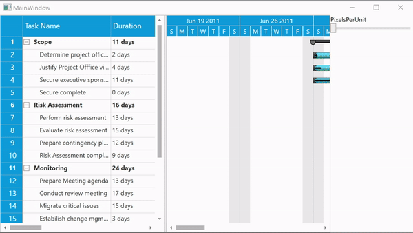

## How to refresh WPF Gantt schedule

This article explains how to refresh/redraw the Gantt schedule in Syncfusion WPF Gantt control. It has been achieved by invoking the RedrawSchedule internal method with the help of Reflection. 
 
Here, considers the use case to expand the size of scheduler hearder cell per the value changed by Slider.

**[XAML]**

  ```
  …
        <gantt:GanttControl x:Name="Gantt"
                            ItemsSource="{Binding TaskDetails}"
                            CustomScheduleSource="{Binding CustomScheduleSource}"
                            ScheduleType="CustomDateTime"
                            VisualStyle="Metro">
        </gantt:GanttControl>

         …

            <Slider Grid.Row="1"
                    Minimum="20"
                    Maximum="100"
                    Value="20"
                    ValueChanged="Slider_ValueChanged" />

         …
```

**[C#]**
```
    …

        private void Slider_ValueChanged(object sender, RoutedPropertyChangedEventArgs<double> e)
        {
            (this.DataContext as ViewModel).CustomScheduleSource[1].PixelsPerUnit = (sender as Slider).Value;
            this.RefreshSchedule();
        }

        private void RefreshSchedule()
        {

            FieldInfo propertyInfo = typeof(GanttControl).GetField(
                                                              "GanttSchedule",
                                                              BindingFlags.Instance | BindingFlags.NonPublic | BindingFlags.Public);

            GanttSchedule ganttSchedule = (GanttSchedule)propertyInfo.GetValue(this.Gantt);
            if (ganttSchedule != null)
            {
                MethodInfo RedrawSchedule = ganttSchedule.GetType().GetMethod("RedrawSchedule", BindingFlags.Instance | BindingFlags.NonPublic);
                RedrawSchedule.Invoke(ganttSchedule, new object[] { });
            }
        }

 ```


## See also

[How to add custom tooltip to Gantt]()
 
[How to define your own schedule for Gantt to track the progress of projects]()
 
[How to differentiate the dates of holidays]()

